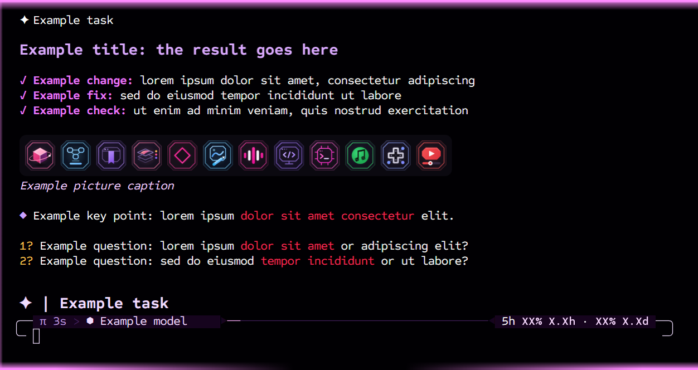
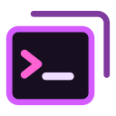

# r7-Shell

r7-Shell is a lean custom terminal for Windows, made for running agents like Claude Code, Codex and my own r7-Harness in WSL, as well as anything else you'd run in a terminal.

Sessions run in the background in WSL, so they survive the app restarting or crashing, and the windows come back where they were. Closing a window ends its session, but `r7shell reopen` brings it back within 10 seconds. The `r7shell` command can start sessions, type into them, wait for output and take screenshots of a window, so an agent can run other terminals without touching your mouse or keyboard.

- Attention flash in the theme color when an agent finishes a response in a window you're not looking at, repeating every 30 seconds until you look
- Hooks for Claude Code and Codex, and the normal terminal bell for anything else
- Water launch screen while an agent starts, and what you type goes into its input box once it's ready
- Pinned images in the top corner, with a preview on hover
- Smooth scrolling, with new text fading in and moved rows gliding into place
- Links and file paths open on a plain click, and images in the output open full size
- Templates (command, folder, theme, font) and themes as small JSON files

## With r7-Harness

r7-Harness and r7-Shell send each other a few extra things, so running r7-Harness in r7-Shell gives you bigger reply titles, pictures right inside replies, numbered questions you can click to start your answer, a bigger task title above the input box that scrolls when it's long, and mouse editing in the input box (drag to select, `Ctrl+click` to move the cursor).

The r7harness template runs `r7harness launch`, so put it on your PATH first: `ln -s ~/r7-Harness/bin/r7harness ~/.local/bin/r7harness`.

## Setup

It runs on Windows 11 with WSL. You need Node 22.12 or newer inside WSL.

```bash
git clone https://github.com/RyanWheeler7321/r7-Shell.git
cd r7-Shell
bash install.sh
r7shell new bash --activate
```

The install gets the packages (the app uses the Windows build of Electron), adds the `r7shell` command to `~/.local/bin` and prints the hook lines for Claude Code and Codex. `r7shell help` lists every command.

Templates are in `templates/` and themes in `themes/`. Settings are in `%LOCALAPPDATA%\r7shell\settings.json`, and its `defaultTemplate` picks what a new window runs. To keep your own templates and themes out of the repo, point `extras` there at a folder with `templates/` and `themes/` inside.

It's pretty new and mostly built around my own setup, but it should work with any terminal program that runs in WSL.

More information: https://r7321.art/tools/r7shell/
